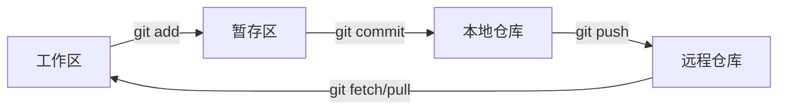

以下是 Git 常用命令的分类整理，涵盖日常开发中最频繁使用的操作，并附上简明解释和示例：

---

### ​**​1. 仓库初始化与克隆​**​

|命令|作用|示例|
|---|---|---|
|`git init`|初始化本地仓库|`git init my-project`|
|`git clone <url>`|克隆远程仓库|`git clone https://github.com/user/repo.git`|

---

### ​**​2. 基础文件操作​**​

|命令|作用|示例|
|---|---|---|
|`git add <file>`|添加文件到暂存区|`git add index.html`|
|`git add .`|添加所有修改到暂存区|`git add .`|
|`git reset <file>`|撤销暂存区的文件|`git reset README.md`|
|`git rm <file>`|删除文件并暂存|`git rm old-file.txt`|
|`git mv <old> <new>`|重命名文件并暂存|`git mv old.txt new.txt`|

---

### ​**​3. 提交与日志​**​

|命令|作用|示例|
|---|---|---|
|`git commit -m "msg"`|提交暂存区的修改|`git commit -m "Fix login bug"`|
|`git commit --amend`|修改最后一次提交|`git commit --amend -m "New message"`|
|`git log`|查看提交历史|`git log --oneline`|
|`git show <commit>`|查看某次提交的详情|`git show abc123`|

---

### ​**​4. 分支管理​**​

|命令|作用|示例|
|---|---|---|
|`git branch`|查看本地分支|`git branch -a`（含远程分支）|
|`git branch <name>`|创建新分支|`git branch feature/login`|
|`git checkout <branch>`|切换分支|`git checkout main`|
|`git checkout -b <branch>`|创建并切换分支|`git checkout -b hotfix`|
|`git merge <branch>`|合并分支到当前分支|`git merge feature/login`|
|`git rebase <branch>`|变基当前分支|`git rebase main`|
|`git branch -d <branch>`|删除分支|`git branch -d old-feature`|

---

### ​**​5. 远程仓库操作​**​

|命令|作用|示例|
|---|---|---|
|`git remote -v`|查看远程仓库地址|`git remote -v`|
|`git fetch`|拉取远程更新（不合并）|`git fetch origin`|
|`git pull`|拉取并合并远程分支|`git pull origin main`|
|`git push`|推送本地提交到远程|`git push origin feature`|
|`git push -u origin <branch>`|推送并关联远程分支|`git push -u origin new-branch`|

---

### ​**​6. 撤销与回退​**​

|命令|作用|示例|
|---|---|---|
|`git restore <file>`|撤销工作区修改|`git restore script.js`|
|`git reset --soft <commit>`|回退提交但保留修改|`git reset --soft HEAD~1`|
|`git reset --hard <commit>`|彻底回退到某次提交|`git reset --hard abc123`|
|`git revert <commit>`|撤销某次提交（生成新提交）|`git revert bad123`|

---

### ​**​7. 暂存与标签​**​

|命令|作用|示例|
|---|---|---|
|`git stash`|暂存当前修改|`git stash`|
|`git stash pop`|恢复暂存的修改|`git stash pop`|
|`git tag v1.0`|创建标签|`git tag -a v1.0 -m "Release"`|
|`git push --tags`|推送标签到远程|`git push origin --tags`|

---

### ​**​8. 实用技巧​**​

|命令|作用|示例|
|---|---|---|
|`git diff`|查看未暂存的修改|`git diff HEAD~2 HEAD`|
|`git cherry-pick <commit>`|选择性合并提交|`git cherry-pick abc123`|
|`git reflog`|查看所有操作记录（救命用）|`git reflog`|
|`git config --global alias.co checkout`|设置命令别名|`git config --global alias.st status`|

---

### ​**​常用组合命令​**​

1. ​**​拉取最新代码并合并​**​
    
    ```
    git pull --rebase origin main
    ```
    
2. ​**​强制推送（谨慎使用）​**​
    
    ```
    git push -f origin branch-name
    ```
    
3. ​**​清理本地已合并的分支​**​
    
    ```
    git branch --merged \| grep -v "main" \| xargs git branch -d
    ```
    

---

### ​**​图解关键流程​**​



掌握这些命令后，可覆盖 90% 的日常 Git 操作需求！遇到复杂问题时，记得善用 `git reflog`和 `git reset`回退。